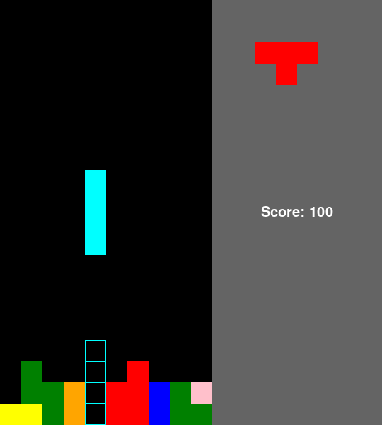

# Tetris Game

This is a simple implementation of the classic Tetris game using Python and Pygame.



## Requirements

- Python 3.x
- Pygame

To install Pygame, run the following command:

```bash
python3 -m pip install pygame
```

## Installation

1. Clone the repository or download the code files.
2. Install the required dependencies by running the following command:


## Usage

To start the game, run the following command in your terminal or command prompt:


### Controls

- Use the **Left** and **Right** arrow keys to move the current tetromino sideways.
- Use the **Down** arrow key to move the current tetromino downwards faster.
- Use the **Space** key to rotate the current tetromino.
- Press **Q** to quit the game.
- Press **D** to move the current tetromino all the way down instantly.
- Press **S** to take a screenshot of the game window. Screenshots will be saved in the "screenshots" folder.

### Objective

The objective of the game is to complete as many rows as possible by filling them with tetromino shapes. When a row is completely filled, it will be cleared, and the player's score will increase. The game ends when the tetromino stack reaches the top of the grid.

## Customization

You can customize various aspects of the game by modifying the `config.py` file:

- Adjust the game field dimensions (width and height) in the `game_width` and `game_height` variables.
- Change the block size (pixel size of each tetromino block) in the `block_size` variable.
- Toggle the visibility of the ghost figure by setting the `ghost` variable to `True` or `False`.
- Modify the score increment value in the `score_increment` variable.
- Adjust the game speed by modifying the `game_speed` variable.

## License

This project is licensed under the [MIT License](LICENSE).

Feel free to use, modify, and distribute the code as per the terms of the license.

## Acknowledgments

This implementation is inspired by the classic game Tetris and built using the Pygame library.

